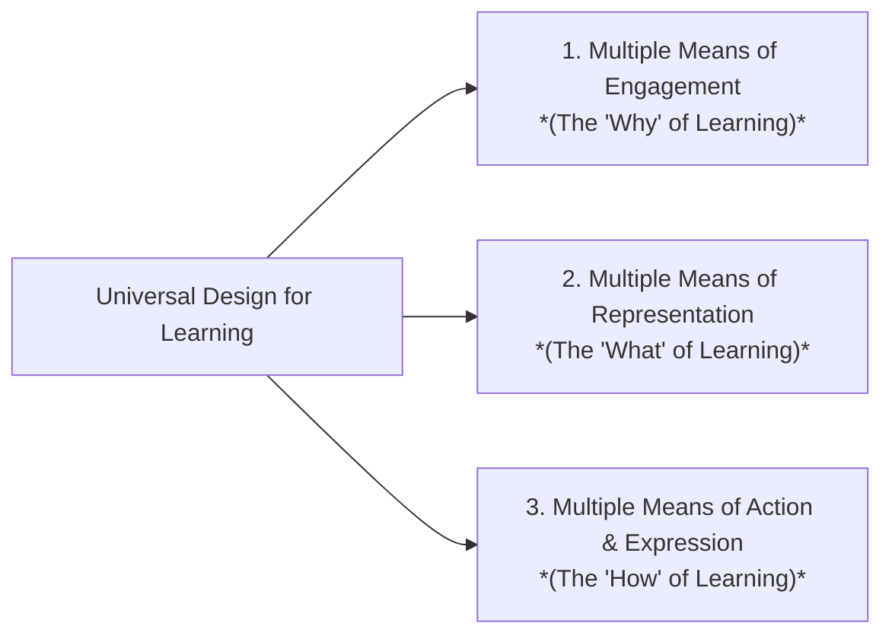

# Accessible Learning Design: WCAG 2.2 AA & UDL Reference

Designing accessible learning ensures that all learners — including those with visual, auditory, motor, neurodivergent, or cognitive differences — can fully engage, understand, and demonstrate mastery.

---

## 1. WCAG 2.2 Level AA Checklist for Digital Learning & eLearning

### A. Perceivable (Information must be presentable in ways learners can perceive)

| Requirement | Standard | Practical ID Implementation Rule |
| :--- | :--- | :--- |
| **Color Contrast** | Minimum **4.5:1** for regular text; **3:1** for large text ($\ge 18\text{pt}$ or $\ge 14\text{pt}$ bold) and UI components | Never place light gray text on white backgrounds or dark blue text on black slides. Test palettes using contrast checkers. |
| **Color Independence** | Information cannot rely on color alone | Never say *"Click the green button"* or indicate correct/incorrect answers with red/green circles alone — always pair color with text labels, icons (✅ / ❌), or shape patterns. |
| **Non-Text Content (Alt Text)** | All meaningful images require accurate alt text; decorative images marked empty (`alt=""`) | **For diagrams/infographics**: Provide brief alt text in the image and a comprehensive text breakdown in the adjacent paragraph or expandable accordion. |
| **Captions (Prerecorded)** | Synchronized closed captions (WebVTT / SRT) required for all video | Provide accurate captions matching speech with speaker identification and meaningful non-speech audio cues (e.g., `[Applause]`, `[Timer chiming]`). |
| **Audio Transcripts** | Full descriptive text transcript for podcasts and audio clips | Include spoken dialogue, speaker names, and descriptions of essential background audio sounds. |

#### Pattern: Alt-Text for Complex Instructional Diagrams
For complex charts, flowcharts, or system architectures, use the **Two-Layer Description Pattern**:
1. **Short Alt Text (Layer 1)**: `alt="Flowchart illustrating the 3-step escalation protocol from Level 1 Support to Senior Engineering."`
2. **Detailed Contextual Text (Layer 2)**: Include a structured bullet list or table immediately below the graphic describing each node and conditional branch so screen readers and all learners can navigate the logic step-by-step.

---

### B. Operable (Interface components and navigation must be operable by all)

| Requirement | Standard | Practical ID Implementation Rule |
| :--- | :--- | :--- |
| **Keyboard Accessibility** | 100% of interactive widgets must work via keyboard alone (`Tab`, `Shift+Tab`, `Enter`, `Space`, `Arrows`) | Ensure no keyboard traps exist. Focus state must have a visible, high-contrast indicator ring. |
| **Drag-and-Drop Alternatives** | Drag-and-drop interactions must have accessible alternatives | If designing an activity where learners drag items into categories, provide an accessible alternate format (e.g., dropdown selection menus or multi-choice lists). |
| **Timing & Time Limits** | Learners must be able to turn off, adjust, or extend time limits | Avoid hard quiz countdown timers unless timing is an essential business competence (e.g., emergency dispatch). Allow at least $10\times$ time extensions. |
| **Seizure & Physical Reactions** | No content flashes more than 3 times per second | Avoid strobe animations, rapid flashing banner graphics, or auto-playing videos with sudden motion. |

---

### C. Understandable (Information and operation must be clear and predictable)

* **Readability & Plain Language**: Match language complexity to the audience. Avoid unnecessary academic or technical jargon; define specialized terms at first mention.
* **Predictable Navigation**: Keep navigation controls (Next, Previous, Menu, Audio Controls) in consistent locations across all slides/screens.
* **Error Identification & Clear Suggestions**: When a learner fails a formative check, state specifically what was incorrect and provide actionable guidance on how to remediate (e.g., *"Option B missed Step 2 of the safety protocol. Review Section 3 to see the required pre-check."*).

---

## 2. Universal Design for Learning (UDL) Practical Matrix

UDL provides a blueprint for creating instructional goals, methods, materials, and assessments that work for everyone not as a single, one-size-fits-all solution, but rather flexible approaches.

| UDL Principle | Core Goal | Practical ID Tactics |
| :--- | :--- | :--- |
| **1. Multiple Means of Engagement** *(Affective Network)* | Foster learner motivation, autonomy, and sustained effort | • Offer choice in scenario contexts (e.g., select Industry A or B for the capstone case study). • Connect activities to authentic real-world workplace dilemmas. • Provide self-paced reflection prompts and low-stakes practice before high-stakes testing. |
| **2. Multiple Means of Representation** *(Recognition Network)* | Present information and content in varied formats | • Dual-code core concepts (pair concise visual diagrams with narrative explanations). • Offer multi-modal media options (video walkthrough + downloadable text transcript / job aid). • Provide vocabulary glossaries and activate prior knowledge schemas. |
| **3. Multiple Means of Action & Expression** *(Strategic Network)* | Allow learners to demonstrate mastery through flexible modalities | • Provide multiple assessment options (e.g., submit a written proposal, a slide presentation, or an audio walkthrough). • Scaffold complex tasks with step-by-step rubrics, checklists, and templates. • Provide explicit goal-setting and self-monitoring tracking tools. |

---

## 3. Quick Accessibility Quality Check

Before publishing or finalizing any instructional design deliverable, verify:
- [ ] Are all fonts clean, highly legible (sans-serif preferred for digital), and sized $\ge 14\text{pt}$?
- [ ] Is color contrast verified $\ge 4.5:1$ across all slides and graphics?
- [ ] Are interactive elements navigable without a mouse?
- [ ] Do all video/audio assets include captions and text transcripts?
- [ ] Does the assessment evaluate actual competency rather than physical dexterity or speed?
- [ ] Is language complexity appropriate for the audience — plain language used, jargon defined at first use? *(WCAG 3.1.5 Reading Level)*
- [ ] Do all interactive components show a clearly visible, high-contrast focus indicator ring when navigated by keyboard? *(WCAG 2.4.11 Focus Appearance — new in WCAG 2.2)*

