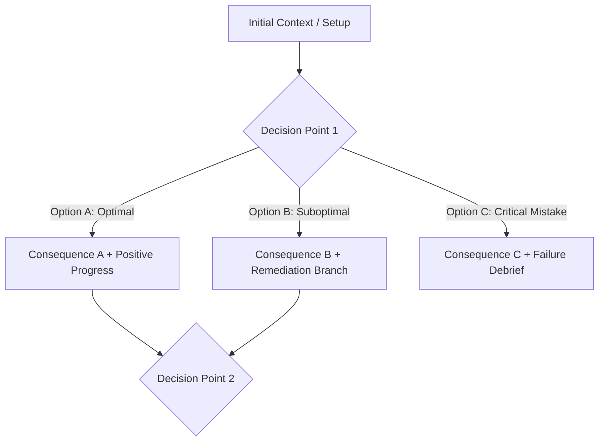

# Branching Scenario Script: [Scenario Title]

## 1. Scenario Metadata & Learning Objective
* **Target Audience**: [Learner role]
* **Target Competency / Behavior**: [Specific behavior being practiced]
* **Learning Objective**: *By completing this scenario, learners will be able to [Bloom's Verb] [Observable Action] in a high-stakes decision environment.*
* **Context / Setting**: [Workplace setting, customer encounter, emergency situation, etc.]

---

## 2. Character & Stakeholder Profiles
* **Protagonist (Learner Role)**: [Name / Role, e.g., Sarah, Junior Project Manager]
* **Key Stakeholder / Counterpart**: [Name / Role, e.g., Alex, Frustrated Product Owner]
* **Core Conflict**: [Underlying tension, competing priorities, or ambiguity]

---

## 3. Decision Tree Narrative Flow

---

## 4. Node-by-Node Script & Feedback

### Node 1: Scene Setup
* **Context**: [Describe the opening scene. What information does the learner have? What pressure is present?]
* **The Dilemma**: [What must be decided right now?]

#### Decision Point 1: What do you do?
* **[Option A] (Best Practice)**: `[Action description]`
  * **Consequence / Response**: `[Stakeholder reaction and outcome]`
  * **Instructional Feedback**: ✅ *Optimal choice because... (Ground in theory/policy)*
  * **Next Node**: Proceed to [Node 2A].

* **[Option B] (Suboptimal / Plausible Distractor)**: `[Action description]`
  * **Consequence / Response**: `[Stakeholder reaction showing friction or partial failure]`
  * **Instructional Feedback**: ⚠️ *Suboptimal because... (Highlight what was missed)*
  * **Next Node**: Proceed to [Node 2B (Remediation)].

* **[Option C] (Critical Error / Common Misconception)**: `[Action description]`
  * **Consequence / Response**: `[Escalation, relationship damage, or system outage]`
  * **Instructional Feedback**: ❌ *Critical pitfall. This leads to...*
  * **Next Node**: Proceed to [Debrief / Restart Scenario].

---

### Node 2: Escalation / Resolution
*(Repeat structure for follow-up decision nodes as needed)*

---

## 5. Scenario Debrief & Reflection Questions
1. What was the critical pivot point where the outcome was determined?
2. How does this decision dynamic translate to your daily workflow?
3. What framework or checklist can you use to prevent Option C in real life?
